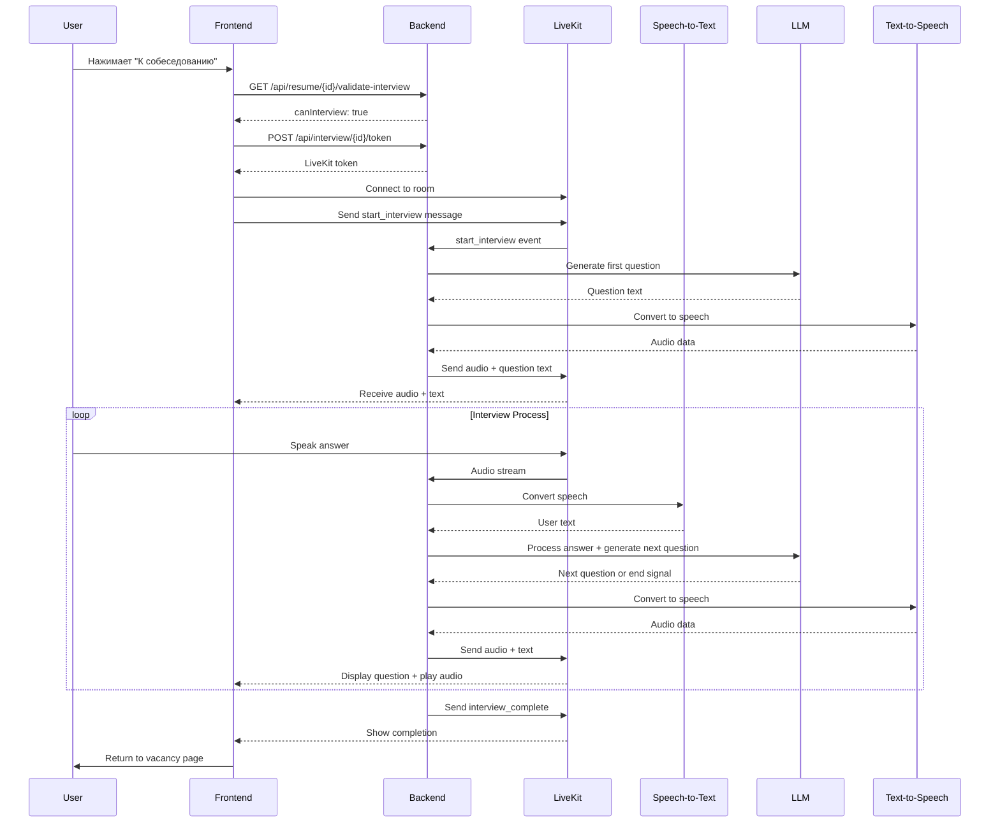

# HR Interview Integration with LiveKit

## Обзор

Система интеграции для проведения голосовых собеседований с HR AI агентом через LiveKit. Пользователь общается голосом с AI, который анализирует речь, генерирует вопросы через LLM и отвечает синтезированной речью.

## Архитектура

### Frontend (Ready)
- ✅ Кнопка "К собеседованию" для резюме со статусом `parsed`
- ✅ Страница `/interview/[id]` с проверкой доступности
- ✅ Компонент `InterviewSession` с LiveKit интеграцией
- ✅ Аудио-только режим (без видео)
- ✅ Управление микрофоном и завершением сессии

### Backend API Requirements

#### 1. Валидация резюме для собеседования
```http
GET /api/resume/{resumeId}/validate-interview
```

**Response:**
```json
{
  "canInterview": true,
  "message": "Resume is ready for interview"
}
```

**Error cases:**
- `404` - резюме не найдено
- `400` - резюме не готово (статус не `parsed`)

#### 2. Получение токена для LiveKit
```http
POST /api/interview/{resumeId}/token
```

**Response:**
```json
{
  "token": "livekit_jwt_token_here",
  "roomName": "interview_room_123",
  "serverUrl": "wss://your-livekit-server.com"
}
```

### LiveKit Server Integration

#### Environment Variables
```env
NEXT_PUBLIC_LIVEKIT_URL=wss://your-livekit-server.com
LIVEKIT_API_KEY=your_api_key
LIVEKIT_API_SECRET=your_api_secret
```

#### Server-side Components

1. **LiveKit Room Management**
   - Создание уникальных комнат для каждого собеседования
   - Управление участниками (пользователь + AI агент)
   - Токены с ограниченными правами

2. **Speech-to-Text Service**
   - Получение аудио потока от пользователя
   - Конвертация речи в текст в реальном времени
   - Определение пауз в речи для передачи в LLM

3. **LLM Processing**
   - Анализ текста от пользователя
   - Генерация вопросов на основе резюме
   - Контекст предыдущих ответов
   - Логика завершения собеседования

4. **Text-to-Speech Service**
   - Конвертация ответов LLM в аудио
   - Передача аудио потока через LiveKit

#### Data Flow



#### Message Protocol

**Frontend → Server:**
```json
{
  "type": "start_interview",
  "resumeId": 123
}

{
  "type": "end_interview", 
  "resumeId": 123
}
```

**Server → Frontend:**
```json
{
  "type": "question",
  "text": "Расскажите о своем опыте в разработке",
  "questionNumber": 1
}

{
  "type": "ai_speaking_start"
}

{
  "type": "ai_speaking_end"
}

{
  "type": "interview_complete",
  "summary": "Interview completed successfully"
}
```

### Implementation Steps

#### Priority Implementation Order
1. **Phase 1**: Базовые API endpoints + LiveKit токены (минимальный MVP)
2. **Phase 2**: Аудио pipeline (STT/TTS)
3. **Phase 3**: LLM интеграция и логика собеседования

#### Backend Setup
1. **Install LiveKit SDK**
   ```bash
   pip install livekit livekit-api
   # or
   npm install livekit-server-sdk
   ```

2. **Create LiveKit Room Service**
   ```python
   from livekit import api
   
   class InterviewRoomService:
       def create_room(self, resume_id: int):
           room_name = f"interview_{resume_id}_{timestamp}"
           # Create room logic
           
       def generate_token(self, room_name: str, participant_name: str):
           # Generate JWT token
   ```

3. **Implement API Endpoints**
   - Resume validation endpoint
   - Token generation endpoint
   - WebRTC signaling handling

4. **Set up Audio Processing Pipeline**
   - Speech-to-Text service (Google, Azure, или OpenAI Whisper)
   - Text-to-Speech service (Google, Azure, или ElevenLabs)
   - LLM integration (OpenAI GPT, Claude, или локальная модель)

5. **Database Schema Updates**
   ```sql
   ALTER TABLE resumes ADD COLUMN interview_session_id VARCHAR(255);
   ALTER TABLE resumes ADD COLUMN interview_completed_at TIMESTAMP;
   
   CREATE TABLE interview_sessions (
       id SERIAL PRIMARY KEY,
       resume_id INTEGER REFERENCES resumes(id),
       room_name VARCHAR(255),
       status VARCHAR(50),
       started_at TIMESTAMP,
       completed_at TIMESTAMP,
       transcript TEXT,
       ai_feedback TEXT
   );
   ```

### Security Considerations

1. **Token Security**
   - Ограниченное время жизни токенов
   - Права только на конкретную комнату
   - Валидация прав пользователя

2. **Data Privacy**
   - Шифрование аудио потоков
   - Временное хранение записей
   - GDPR соответствие

3. **Rate Limiting**
   - Ограничение на количество сессий
   - Защита от злоупотреблений

### Testing Strategy

1. **Unit Tests**
   - API endpoints
   - Token generation
   - Message handling

2. **Integration Tests**
   - LiveKit connection
   - Audio pipeline
   - LLM integration

3. **Load Testing**
   - Множественные одновременные сессии
   - Производительность аудио обработки

### Monitoring & Analytics

1. **Metrics**
   - Время подключения к сессии
   - Качество аудио соединения
   - Длительность собеседований
   - Процент завершенных интервью

2. **Logging**
   - События соединения
   - Ошибки аудио обработки
   - LLM запросы и ответы

### Deployment

1. **LiveKit Server**
   - Развертывание сервера LiveKit
   - SSL сертификаты
   - Настройка TURN серверов для NAT

2. **Scaling**
   - Горизонтальное масштабирование
   - Load balancing
   - CDN для статических ресурсов

## Quick Start для Backend разработчика

### Minimum Viable Product (1-2 дня)
1. **Заглушки API endpoints:**
   ```python
   # Всегда возвращать canInterview: true
   GET /api/resume/{id}/validate-interview
   
   # Вернуть тестовый LiveKit токен
   POST /api/interview/{id}/token
   ```

2. **Настроить LiveKit server локально:**
   ```bash
   docker run --rm -p 7880:7880 -p 7881:7881 -p 7882:7882 \
     -e LIVEKIT_KEYS="your-api-key: your-secret-key" \
     livekit/livekit-server:latest
   ```

3. **Тестирование соединения:**
   - Frontend должен подключиться к LiveKit
   - Пользователь увидит интерфейс собеседования
   - Микрофон должен работать

### Full Implementation (1-2 недели)
После MVP добавить:
- Реальную логику валидации резюме
- Speech-to-Text processing
- LLM для генерации вопросов  
- Text-to-Speech для ответов AI
- Сохранение результатов в БД

### Возможные упрощения для MVP:
- Валидацию можно убрать (всегда разрешать)
- Вместо AI агента показывать заглушку "Скоро здесь будет AI интервьюер"
- Логи всех действий в консоль для отладки

## Current Status

✅ **Completed:**
- Frontend компоненты готовы
- LiveKit интеграция настроена
- UI для собеседования реализован

🔄 **Next Steps:**
1. Реализовать backend API endpoints
2. Настроить LiveKit server
3. Интегрировать Speech-to-Text/Text-to-Speech
4. Подключить LLM для генерации вопросов
5. Тестирование и отладка

### Contact Frontend Developer
При вопросах по интеграции:
- Формат сообщений между клиентом и сервером
- Структура токенов LiveKit
- Обработка ошибок на фронтенде